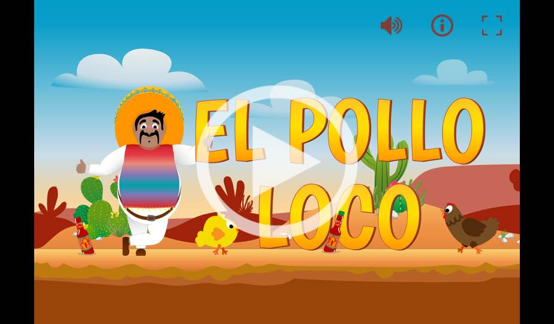
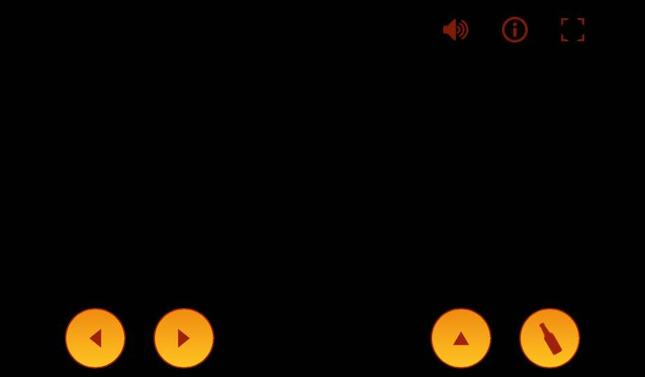

# 🌵 El Pollo Loco

A 2D jump-and-run browser game built with vanilla **JavaScript (OOP)**, **HTML5 Canvas** and **SCSS**.
Help *Pepe Peligroso* fight his way through the Mexican desert, collect coins and salsa bottles,
and defeat the crazy chicken boss — **El Pollo Loco**.




## 🎮 How to play

| Key | Action |
| --- | --- |
| `←` / `→` | Move left / right |
| `Space` / `↑` | Jump |
| `D` | Throw a salsa bottle |

On touch devices (phone / tablet) on-screen controls appear automatically.
The game is designed for **landscape** orientation.

## ✨ Features

- Object-oriented architecture (dedicated `classes/` folder)
- HTML5 Canvas rendering with parallax background
- Character animations: idle, long-idle/sleep, walk, jump, hurt, dead
- Two enemy types (chicken, baby chicken) plus a stronger **endboss**
- Collectables (coins, bottles) with live status bars
- Background music & sound effects, mutable via the menu bar
  (mute state persisted in `localStorage`)
- Win / lose end screens with **restart without page reload**
- Responsive: on-screen touch controls + portrait "rotate device" hint
- Fullscreen mode
- JSDoc documentation (generated into `docs/`)

## 🗂️ Project structure

```
El-Pollo-Loco/
├── assets/      # images, fonts, audio (audio to be added)
├── classes/     # all game classes (*.class.js)
├── js/          # game logic, input, audio, UI, level data
├── styles/      # SCSS sources + compiled style.css
├── docs/        # generated JSDoc
├── index.html   # game entry point
└── impressum.html
```

## 🚀 Run locally

Just open `index.html` in a modern browser, or serve the folder with any static
server (e.g. VS Code "Live Server").

> **Note:** the audio files belong in `assets/audio/` (and `assets/audio/music/`).
> See `js/load-audio.js` for the expected file names.

## 🛠️ Build styles

The CSS is compiled from SCSS:

```bash
sass styles/style.scss styles/style.css
```

## 👤 Author

**Alexander Lindt** — project built during the Developer Akademie course.
